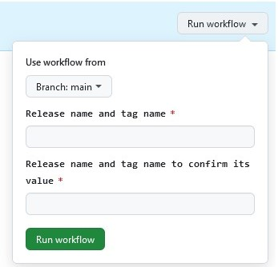

# GitHub Workflows

This folder contains the workflow files for GitHub Actions. To run these workflows, simply go to the "Actions" link above.

## Creating a New Release

This is the GitHub Action ``Create Release Manually`` and is used to create (i.e. tag) a new NITA release. When you run this action, it requests a value that will be used as the Release Name and Tag Name, with the following input dialogue:

The same value will be used for both the Release and the Tag. Enter a number such as "24.09" for example. The workflow asks for it twice here, to help avoid the mistake of mistyping.

The workflow actions are defined in the file ``release_manual.yml`` and are described here:
 - Takes the tag and writes it to the file ``VERSION.txt``
 - Checks the Software Bill of Materials (SBOM) for all Python code, and writes the copyright details for each dependency to a file called ``NOTICES.spdx.json``
 - Updates the copyright message with the correct year in the files ``README.md`` and ``LICENSE.txt``
 - Commits all of these changes back to the repo
 - Creates a release artifact based on the given tag
