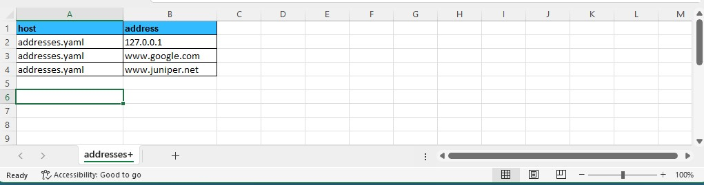

[branch]: https://github.com/Juniper/nita/tree/tt234
[readme]: https://github.com/Juniper/nita/blob/tt234/README.md

# NITA YAML-to-Excel 23.12

Welcome to NITA, an open source platform for automating the building and testing of complex networks.

# Release Notes
This project consists of the tools required for manipulating YAML files and Microsoft excel spreadsheet files.

For details about NITA, please refer to the parent [README][readme].

# Installation

NITA YAML-to-Excel is a standalone application that does not require Kubernetes or the other NITA modules. You can simply download it from this repo and install it using pip3:

```bash
$ wget https://github.com/Juniper/nita-yaml-to-excel/archive/refs/heads/main.zip
$ unzip main.zip
$ pip3 install ./nita-yaml-to-excel/
```

# Usage
The most important two programs provided are inside the ``./yamltoexcel`` folder:

## Converting from YAML to Excel

To convert a Yaml formatted file into a Microsoft Excel spreadsheet, do this:

```bash
yaml2xls.py <yaml files> <excel spreadsheet name>
```
This converts one or more yaml files to an excel spreadsheet.

## Converting from Excel to YAML

To convert a Microsoft Excel spreadsheet to YAML format you will first need to create a spreadsheet. There are a few things to be aware of with regards to the format of your spreadsheet:

- Microsoft Excel workbooks must be saved in "XLSX" format. The old "XLS" format is not supported.
- Sheets don't need names, but it helps to give them meaningful names instead of the default `Sheet1` and `Sheet2` etc.
- If you have repeating data in your sheet (i.e. the same YAML variable but with different values), add a "+" to the sheet's name (see screenshot below)
- **Each sheet must have one table heading row, on row one**
- **Column A must be called "host"**. This refers to the destination YAML file where data will be written to.
- A sheet named `base` is special, and must have three columns (A, B, C) named `host`, `name` and `value`
- Any other sheet can have as many columns as you need, called whatever you want

To convert a spreadsheet into a YAML file, the format of the command is this:

```bash
xls2yaml.py <excel spreadsheet name> <destination directory>
```
Here is an example Excel workbook with one sheet called `addresses+` and a table the conforms to the conventions outlined above:



To convert this workbook into YAML, do this:
```bash
user@nita:~/tmp$ ls -al
total 20
drwxrwxr-x 2 host host 4096 Jul 19 08:13 .
drwxr-x--- 9 host host 4096 Jul 19 08:13 ..
-rw-rw-r-- 1 host host 9900 Jul 19 07:56 addresses.xlsx
host@nita:~/tmp$ xls2yaml.py addresses.xlsx .
host@nita:~/tmp$ ls -al
total 24
drwxrwxr-x 2 host host 4096 Jul 19 08:13 .
drwxr-x--- 9 host host 4096 Jul 19 08:13 ..
-rw-rw-r-- 1 host host 9900 Jul 19 07:56 addresses.xlsx
-rw-rw-r-- 1 host host   89 Jul 19 08:13 addresses.yaml
host@nita:~/tmp$ cat addresses.yaml
---
addresses:
- address: 127.0.0.1
- address: www.google.com
- address: www.juniper.net
host@nita:~/tmp$
```

These tools are especially useful when working with NITA project files, to populate the inventory files in YAML format that are used by Ansible.

# Copyright

Copyright 2024, Juniper Networks,Inc.

Permission is hereby granted, free of charge, to any person obtaining a copy of this software and associated documentation files (the "Software"), to deal in the Software without restriction, including without limitation the rights to use, copy, modify, merge, publish, distribute, sublicense, and/or sell copies of the Software, and to permit persons to whom the Software is furnished to do so, subject to the following conditions:

The above copyright notice and this permission notice shall be included in all copies or substantial portions of the Software.

THE SOFTWARE IS PROVIDED "AS IS", WITHOUT WARRANTY OF ANY KIND, EXPRESS OR IMPLIED, INCLUDING BUT NOT LIMITED TO THE WARRANTIES OF MERCHANTABILITY, FITNESS FOR A PARTICULAR PURPOSE AND NONINFRINGEMENT. IN NO EVENT SHALL THE AUTHORS OR COPYRIGHT HOLDERS BE LIABLE FOR ANY CLAIM, DAMAGES OR OTHER LIABILITY, WHETHER IN AN ACTION OF CONTRACT, TORT OR OTHERWISE, ARISING FROM, OUT OF OR IN CONNECTION WITH THE SOFTWARE OR THE USE OR OTHER DEALINGS IN THE SOFTWARE.
